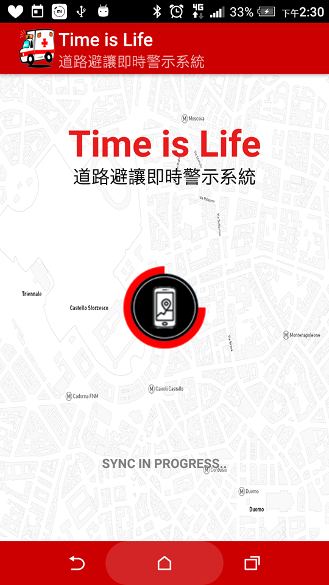
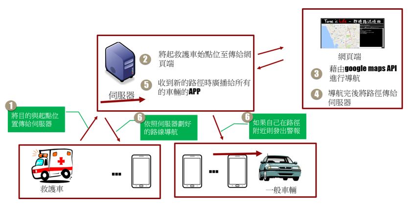

# Time is Life - 道路避讓及時警示系統

## Description
台灣是一個人口密度高的國家，相對的機、汽車密度也高，道路上的車流量非常可觀，也因此產生救護車在返往醫院和救災現場時，因為許多原因而造成救災的延誤，例如前方車輛沒有注意到救護車即將經過、道路前方出現車禍、或是道路上的駕駛人彼此沒有一定的避讓共識等等[1]。近年來新聞上出現駕駛人不禮讓即將經過的救護車情形屢見不鮮，甚至有些案例是因延誤搶救時間，而造成車上病患不治的情況出現。儘管已有部分法條規範駕駛人在面對救護車時應如何進行避讓行為，但仍有大部分的駕駛人缺乏足夠的避讓行為知識而不知所措。

基於上述問題，我們決定設計與實作一款整合Google Map API導航技術與路徑判斷功能的道路避讓即時警示系統，在車輛駕駛將要行駛時使用APP開啟偵測功能，定時判斷是否有救護車即將經過駕駛人當前所在位置進而發出訊息提醒。

## Introduction
[Time is Life - 道路避讓及時警示系統](https://www.youtube.com/watch?v=iOwsqZYc7mw&feature=youtu.be)

## System Architecture

## How to Start
`Google_API_O_I_O_I` folder is android studio folder, just open android studio and import it.

`Server` is an eclipse project.

## Use Language & Packages
- Android Studio / Eclipse
- Java(EE) / Javascript / Html
- WebSocket IO API / Google Map API

## Detail
You can see PPT in the folder, and get more information from it.

【溝通機制】
使用WebSocket進行溝通

【系統架構】
Android <-> Server <-> Google Map API

【環境需求】
1.tomcat v7.0
2.J2EE
3.JDK v1.7

【目前功能尚在實作中。。。】

